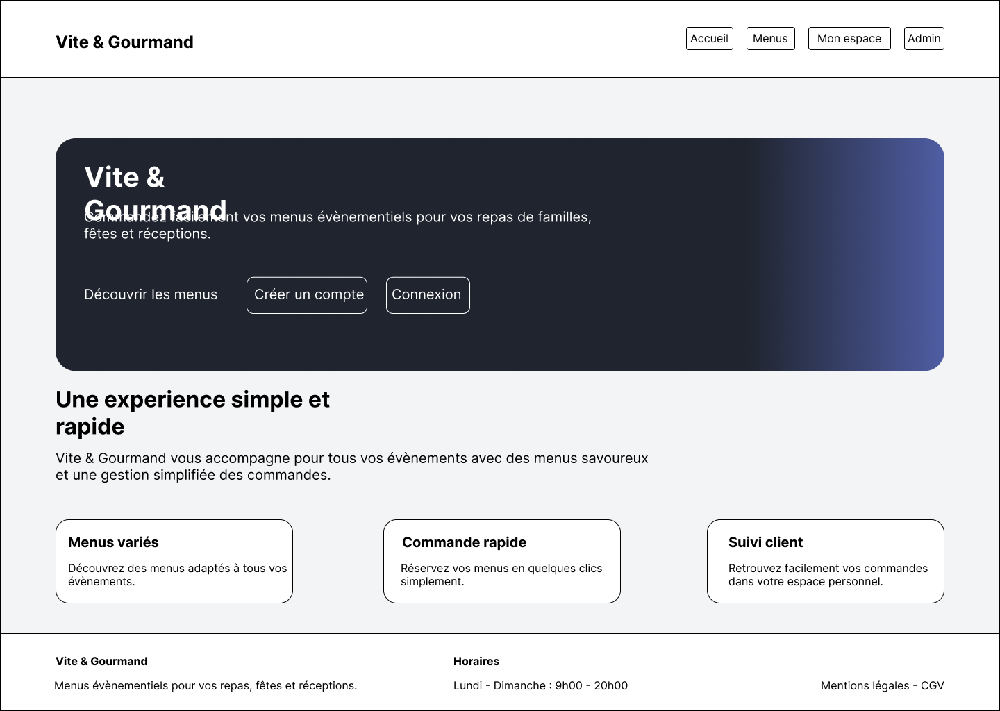
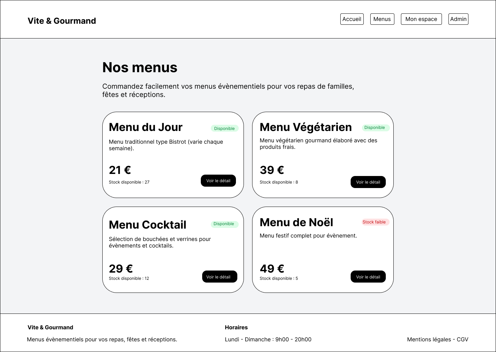
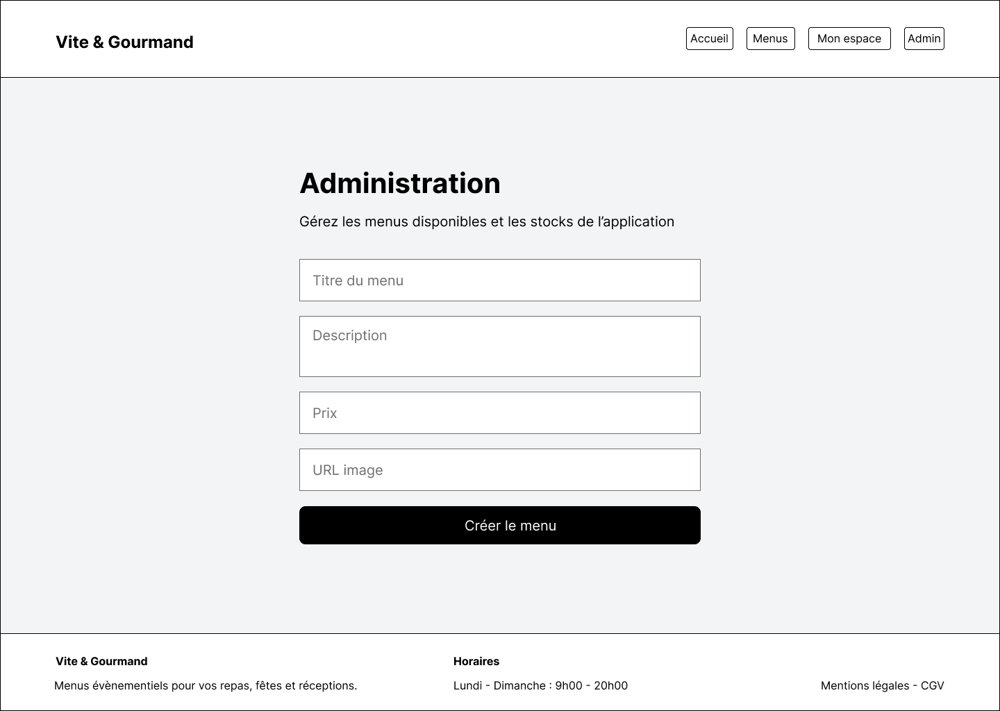

# 🍽️ Vite & Gourmand

> Application web Full Stack de restauration événementielle développée avec **Next.js**, **TypeScript**, **Prisma**, **PostgreSQL** et **MongoDB**.

Projet réalisé dans le cadre de l'**Évaluation en Cours de Formation (ECF)** du titre **Graduate Développeur Web et Web Mobile**.

---

## 📑 Sommaire

- [Présentation](#-présentation)
- [Démonstration](#-démonstration)
- [Fonctionnalités](#-fonctionnalités)
- [Stack technique](#️-stack-technique)
- [Architecture](#️-architecture)
- [Structure du projet](#-structure-du-projet)
- [Installation avec Docker](#-installation-avec-docker)
- [Installation classique](#-installation-classique)
- [Documentation](#-documentation)
- [Scripts SQL](#️-scripts-sql)
- [Captures d'écran](#-captures-décran)
- [Auteur](#-auteur)

---

# 📖 Présentation

Vite & Gourmand est une application web permettant de consulter des menus de restauration événementielle, de créer un compte utilisateur, de passer des commandes et d'en suivre le statut.

Une interface d'administration permet également de gérer les menus proposés ainsi que leur disponibilité.

---

# 🚀 Démonstration

## 🌐 Site déployé

**https://vite-et-gourmand-psi.vercel.app**

---

# ✨ Fonctionnalités

## 👤 Visiteur

- Consultation de la page d'accueil
- Consultation des menus
- Consultation du détail d'un menu
- Création d'un compte
- Connexion

## 👤 Utilisateur

- Accès à son espace personnel
- Consultation des commandes
- Passage de commande
- Suivi des commandes

## 👨‍💼 Administrateur

- Création de menus
- Gestion des menus
- Gestion des stocks

---

# 🛠️ Stack technique

## Front-end

- Next.js 16
- React
- TypeScript
- Tailwind CSS

## Back-end

- API Routes Next.js
- Server Actions
- Prisma ORM

## Bases de données

- PostgreSQL
- MongoDB

## Authentification

- NextAuth

## Déploiement

- Docker
- Vercel

## Versionnement

- Git
- GitHub

---

# 🏗️ Architecture

Le projet est organisé selon une architecture favorisant la séparation des responsabilités.

```text
Interface utilisateur
        │
        ▼
API Routes / Server Actions
        │
        ▼
Services
        │
        ▼
Repositories
        │
        ▼
Prisma ORM
        │
        ▼
PostgreSQL
```

Les statistiques de l'application sont stockées dans **MongoDB**.

---

# 📂 Structure du projet

```text
app/
components/
data/
docs/
lib/
models/
prisma/
public/
repositories/
services/
sql/
types/
```

---

# 🐳 Installation avec Docker

```bash
git clone <url-du-projet>

cd vite-et-gourmand

docker compose up --build
```

L'application est ensuite disponible à l'adresse :

```text
http://localhost:3000
```

---

# 💻 Installation classique

Installation des dépendances :

```bash
npm install
```

Variables d'environnement :

```env
DATABASE_URL=

NEXTAUTH_URL=

NEXTAUTH_SECRET=

MONGODB_URI=
```

Migration Prisma :

```bash
npx prisma migrate dev
```

Lancement du projet :

```bash
npm run dev
```

---

# 📚 Documentation

Toute la documentation technique est disponible dans le dossier :

```text
docs/
```

Elle comprend :

- 📐 Maquettes Figma
- 📊 Diagrammes UML
- 🏗️ Architecture logicielle
- 🔒 Documentation sécurité
- 🚀 Documentation de déploiement

---

# 🗄️ Scripts SQL

Le dossier :

```text
sql/
```

contient les scripts suivants :

- `init.sql` : création de la base de données
- `seed.sql` : initialisation des données

---

# 📸 Captures d'écran

## Accueil



---

## Menus



---

## Détail d'un menu


---

## Mon espace


---

## Administration



---

# 👨‍💻 Auteur

**Benjamin Bernade**

Projet réalisé dans le cadre de l'Évaluation en Cours de Formation (ECF) du titre **Graduate Développeur Web et Web Mobile**.

---

# 📄 Licence

Projet réalisé exclusivement dans le cadre d'une évaluation pédagogique (ECF).

Il est destiné à un usage académique et de démonstration.