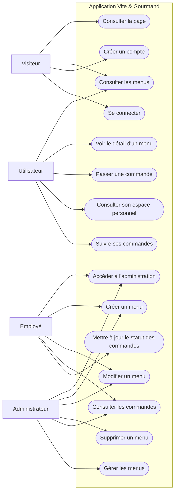

# Diagramme de cas d'utilisation — Application Vite & Gourmand

Ce diagramme présente les principaux acteurs de l'application ainsi que les fonctionnalités auxquelles ils ont accès.

## Description

Le diagramme met en évidence les différents profils d'utilisateurs de l'application ainsi que les principales fonctionnalités mises à leur disposition.

- **Le visiteur** peut consulter le site, parcourir les menus, créer un compte et se connecter.
- **L'utilisateur** peut consulter les menus, visualiser leur détail, passer une commande et suivre ses commandes depuis son espace personnel.
- **L'employé** accède à l'espace d'administration afin de gérer les menus et le suivi des commandes.
- **L'administrateur** dispose de l'ensemble des fonctionnalités d'administration, notamment la création, la modification et la suppression des menus ainsi que la gestion globale des commandes.
