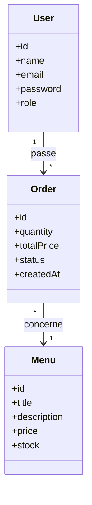

# Diagramme de classes

Ce diagramme représente les principales entités métier de l'application **Vite & Gourmand** ainsi que les relations existant entre elles. Il a servi de support à la conception de la base de données relationnelle utilisée par l'application.

## Description des classes

### User

Représente un utilisateur de l'application.

Deux rôles principaux sont gérés :

- Client
- Administrateur

Chaque utilisateur peut consulter les menus, passer des commandes et accéder aux fonctionnalités correspondant à son rôle.

---

### Menu

Représente un menu proposé par Vite & Gourmand.

Chaque menu possède notamment :

- un titre ;
- une description ;
- un prix ;
- une quantité disponible en stock.

Un même menu peut être commandé par plusieurs utilisateurs.

---

### Order

Représente une commande passée par un utilisateur.

Chaque commande est associée à un seul utilisateur et concerne un seul menu.

Elle enregistre notamment :

- la quantité commandée ;
- le prix total ;
- le statut de la commande ;
- la date de création.