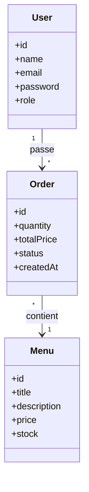

# Diagramme de classes

Ce diagramme représente les principales entités manipulées par l'application.

## Description

### User

Représente un utilisateur de l'application.

Deux rôles sont disponibles :

- Utilisateur
- Administrateur

### Menu

Représente un menu événementiel.

Chaque menu possède :

- un titre
- une description
- un prix
- un stock

### Order

Une commande est créée par un utilisateur et concerne un menu.

Elle contient :

- la quantité
- le prix total
- le statut de la commande.