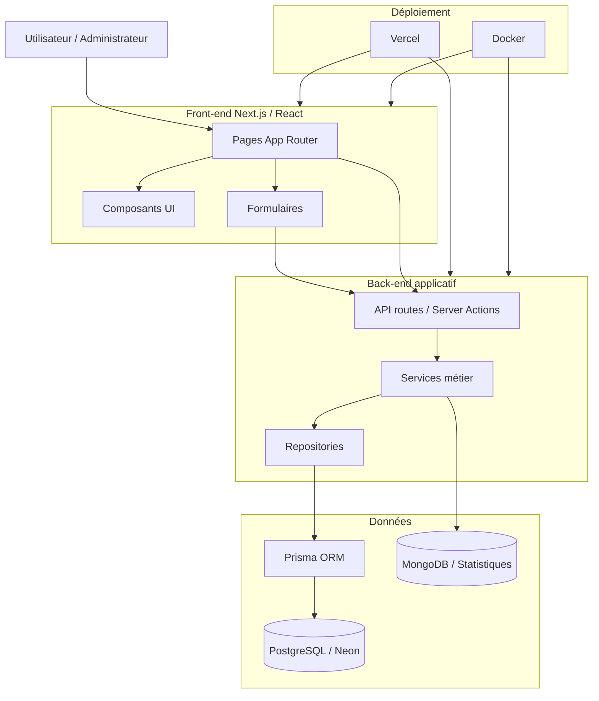

# Diagramme d’architecture applicative

Ce diagramme présente l’organisation générale de l’application Vite & Gourmand.



## Description

L’application est développée avec Next.js et React.

Même si le projet utilise un seul dépôt Git, les responsabilités sont séparées en plusieurs couches :

- `app/` contient les pages, routes et interfaces utilisateur ;
- `components/` contient les composants réutilisables ;
- `services/` contient la logique métier ;
- `repositories/` contient l’accès aux données ;
- `lib/` contient les connexions techniques, notamment Prisma et MongoDB ;
- `models/` contient les modèles utilisés pour les données NoSQL.

## Justification de l’architecture

Cette architecture permet de limiter le mélange entre l’interface utilisateur et la logique métier.

Le parcours général est le suivant :

```txt
Interface utilisateur
    ↓
API routes / actions serveur
    ↓
Services métier
    ↓
Repositories
    ↓
Prisma ORM
    ↓
PostgreSQL
```

Cette séparation rend le projet plus lisible, plus maintenable et plus proche d’une organisation professionnelle.