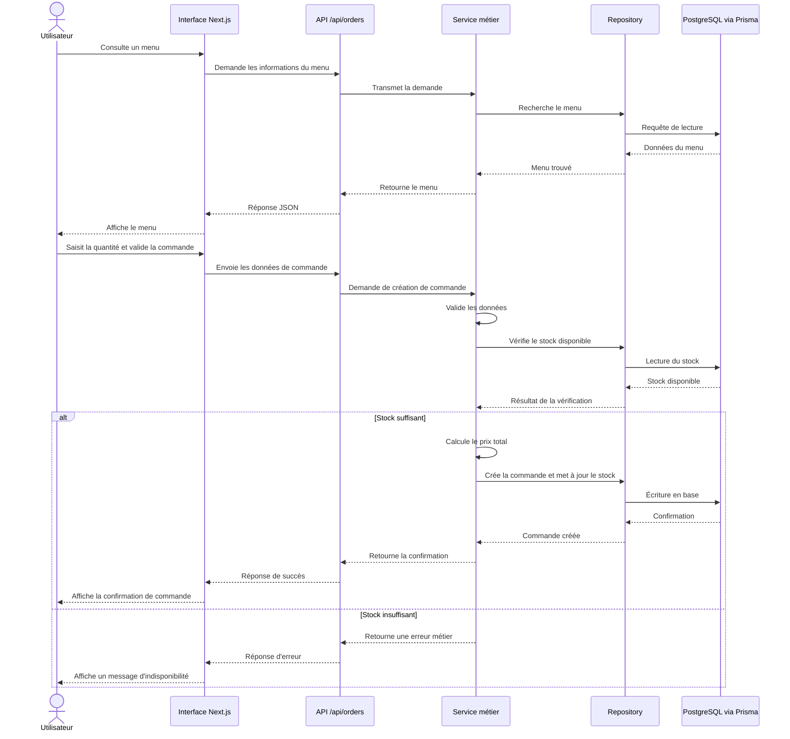

# Diagramme de séquence — Passage d’une commande

Ce diagramme représente le parcours d’un utilisateur connecté lorsqu’il consulte un menu puis passe une commande.

## Description

Le diagramme présente les échanges entre l’utilisateur, l’interface Next.js, la route API, la couche de service, le repository et la base PostgreSQL accessible avec Prisma.

Le traitement comprend :

- la consultation d’un menu ;
- la validation des données saisies ;
- la vérification du stock ;
- le calcul du montant total ;
- la création de la commande ;
- la mise à jour du stock ;
- le retour d’une confirmation ou d’un message d’erreur.
