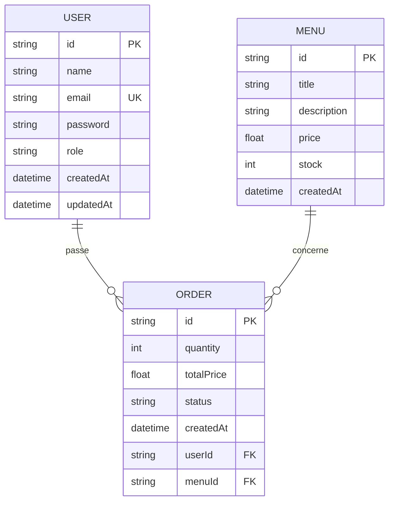

# Schéma de la base de données

## Présentation

Le projet **Vite & Gourmand** s'appuie sur une base de données relationnelle PostgreSQL, accessible via **Prisma ORM**.

Le modèle de données est organisé autour de trois entités principales :

- **User** : représente les utilisateurs de l'application ;
- **Menu** : contient les menus proposés à la vente ;
- **Order** : enregistre les commandes réalisées par les utilisateurs.

Les relations entre ces entités garantissent l'intégrité des données et permettent de retrouver facilement les informations nécessaires au fonctionnement de l'application.

---

## Diagramme entité-association

---

## Description des entités

### USER

Cette entité représente les utilisateurs de l'application.

Elle stocke notamment :

- l'identifiant ;
- le nom ;
- l'adresse électronique ;
- le mot de passe (haché) ;
- le rôle de l'utilisateur.

Un utilisateur peut effectuer plusieurs commandes.

---

### MENU

Cette entité représente les menus proposés par Vite & Gourmand.

Chaque menu possède :

- un titre ;
- une description ;
- un prix ;
- un stock disponible.

Un même menu peut être commandé plusieurs fois.

---

### ORDER

Cette entité représente une commande effectuée par un utilisateur.

Elle enregistre notamment :

- la quantité commandée ;
- le prix total ;
- le statut de la commande ;
- la date de création.

Chaque commande est associée à un utilisateur et concerne un menu.

---

## Choix techniques

Le modèle relationnel a été retenu afin de garantir la cohérence des données grâce aux clés primaires et aux clés étrangères.

L'accès à la base de données est assuré par **Prisma ORM**, qui facilite les opérations CRUD, apporte un typage fort avec TypeScript et simplifie la maintenance du projet.